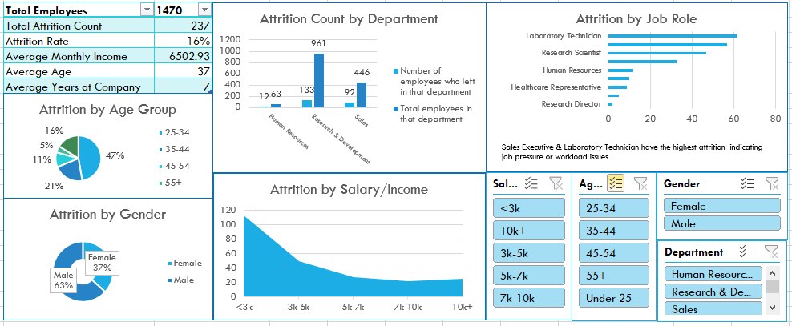

# Employee Attrition Dashboard

## Project Overview
This project is an **interactive Excel dashboard** analyzing employee attrition. It provides insights into which factors contribute to employee turnover, such as age, department, salary, tenure, and job role. The dashboard is designed for **HR analysts, managers, and stakeholders** to make data-driven decisions to reduce attrition.

---

## Objective
- Analyze employee attrition patterns  
- Identify high-risk groups based on demographic and job-related factors  
- Provide an **interactive dashboard** with slicers for dynamic filtering  
- Summarize key metrics and insights for business decisions  

---

## Dataset
- **Source:** Sample HR dataset  
- **Columns include:**  
  - `Age` – Employee age  
  - `Gender` – Male / Female  
  - `Department` – Employee department  
  - `Salary` – Monthly salary  
  - `Attrition_Flag` – 1 if the employee left, 0 otherwise  
  - `YearsAtCompany` – Tenure of employee  
  - `JobRole` – Role/title of employee  
  - `EducationLevel` – Employee education qualification  

---

## Key Features
1. **Interactive PivotTables and Charts**  
   - Attrition by Department, Gender, Age Group, Salary and Job Role
2. **Slicers for Dynamic Filtering**  
   - Filter by Department, Gender, Age Group, and SalaryBin  
3. **Summary KPIs**  
   - Total employees, total attritions, attrition rate (%)  

---

## How to Use
1. Open `Report2.xlsx`  
2. Use slicers to filter data dynamically by department, gender, age group, or salary bin  
3. Hover over charts to see values  
4. Analyze which groups have the highest attrition rates  

---

## Insights / Example Findings
- Employees aged **25–34** show the highest attrition rate  
- Attrition is higher in **low-salary bands (<3k)**  
- Certain **departments** have consistently higher attrition  

---

## Dashboard Preview

---
